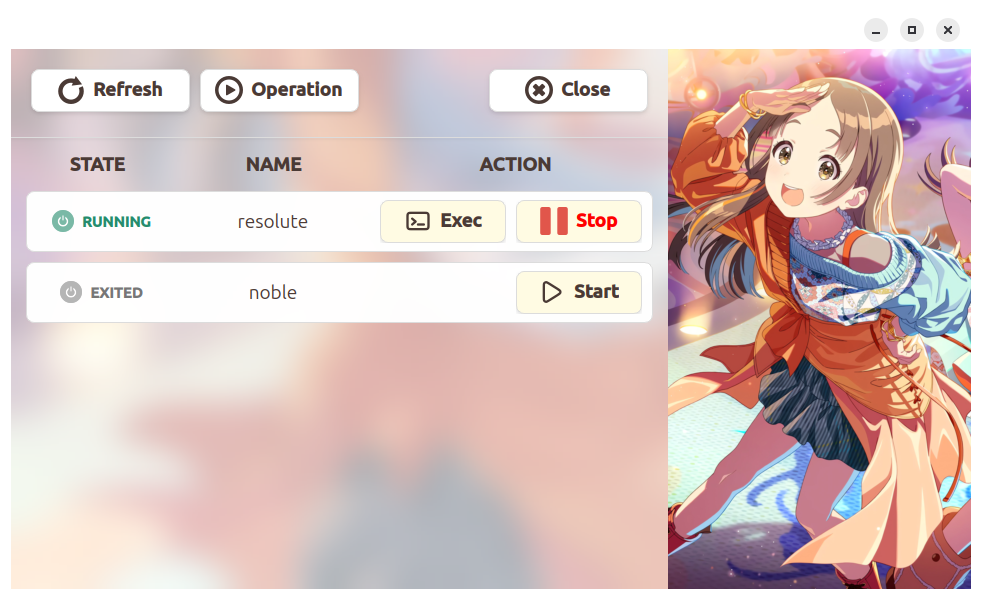
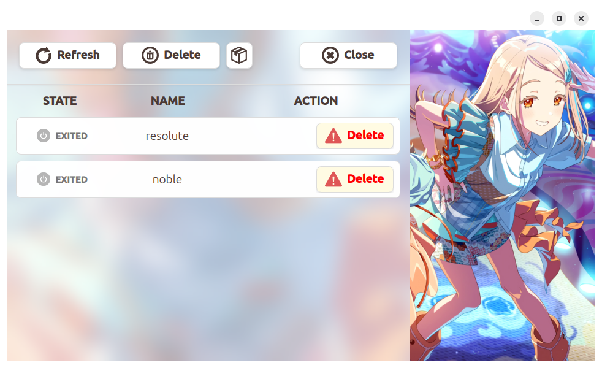
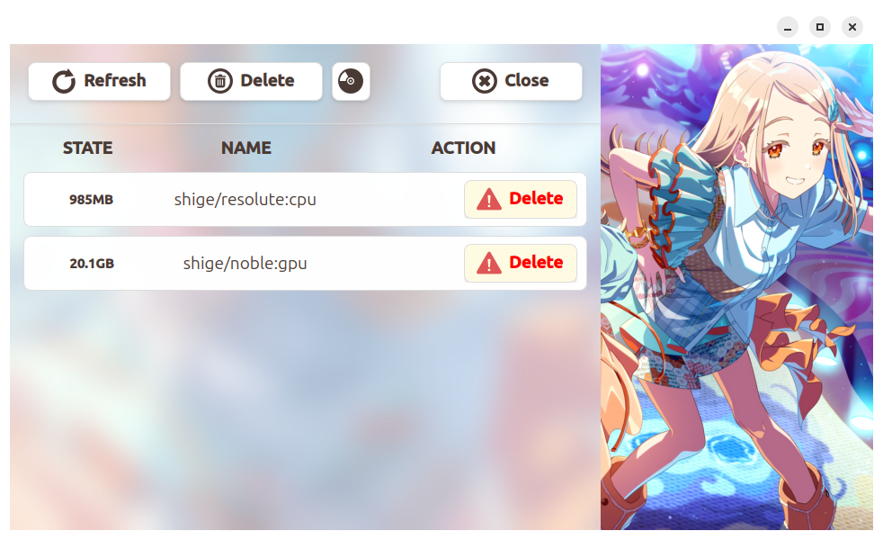

# ContainerExecuter

[![Contributors][contributors-shield]][contributors-url]
[![Forks][forks-shield]][forks-url]
[![Stargazers][stars-shield]][stars-url]
[![Issues][issues-shield]][issues-url]
[![License][license-shield]][license-url]

[JA](README.md) | [EN](README.en.md)

An intuitive PyQt6-based GUI tool for Docker container management.

## UI Modes

### Operation Mode


### Delete Mode (Container / Image)
 

## Installation

Run the following command in the repository root:

```bash
bash install.sh
```

This script automatically handles Docker/NVIDIA setup, dependency installation, and CLI alias configuration.

*Note: Please log out and back in after installation to apply the changes.*

## Usage

### Launch GUI
```bash
ce
```

### Quick Attach via CLI
```bash
dock
```

## Docker Container Setup

You can easily build optimized Docker containers for each project using the scripts in `container/Dockerfiles`.

### 1. Project Naming (Copy Directory)
Copy the `container` directory to match your project name. This name will be used as the Docker image and container (project) name.

```bash
cp -r container/ <project_name>/
```

### 2. Configuration (.env)
Edit `<project_name>/Dockerfiles/.env` to configure settings such as ROS distribution and GPU usage.

```bash
# Example: .env
ROS_DISTRO=jazzy
USE_GPU=true
```

### 3. Launch Container
Run the following script to build and start the container.

```bash
bash <project_name>/Dockerfiles/up.sh
```

## Requirements

- OS: Linux (Ubuntu recommended)
- Python 3.x
- Docker

## License

[MIT License](LICENSE)

## Special Thanks

Background images are from "[Gakuen Idolmaster](https://gakuen.idolmaster-official.jp/)".

[contributors-shield]: https://img.shields.io/github/contributors/m-shigemori/docker?style=for-the-badge
[contributors-url]: https://github.com/m-shigemori/docker/graphs/contributors
[forks-shield]: https://img.shields.io/github/forks/m-shigemori/docker?style=for-the-badge
[forks-url]: https://github.com/m-shigemori/docker/network/members
[stars-shield]: https://img.shields.io/github/stars/m-shigemori/docker?style=for-the-badge
[stars-url]: https://github.com/m-shigemori/docker/stargazers
[issues-shield]: https://img.shields.io/github/issues/m-shigemori/docker?style=for-the-badge
[issues-url]: https://github.com/m-shigemori/docker/issues
[license-shield]: https://img.shields.io/github/license/m-shigemori/docker?style=for-the-badge
[license-url]: https://github.com/m-shigemori/docker/blob/main/LICENSE
