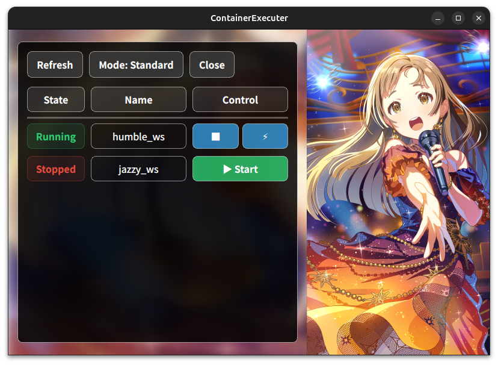
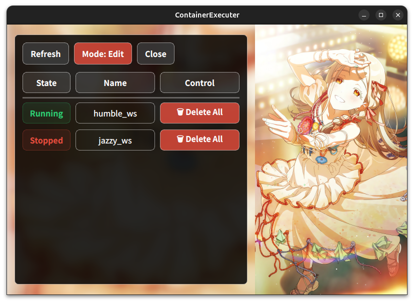

# ContainerExecuter

[![Contributors][contributors-shield]][contributors-url]
[![Forks][forks-shield]][forks-url]
[![Stargazers][stars-shield]][stars-url]
[![Issues][issues-shield]][issues-url]
[![License][license-shield]][license-url]

[JA](README.md) | [EN](README.en.md)

Dockerコンテナの管理を直感的に行うためのGUIツールです．
PyQt5を採用しており，コンテナの起動・停止・アタッチに加え，コンテナとベースイメージの一括削除を簡単に行うことができます．

## 主な機能

- **コンテナ管理**：起動中のコンテナ一覧を表示し，開始・停止操作が可能です．
- **シェル接続**：ワンクリックでコンテナのシェルを新しいターミナルで開きます．
- **一括削除**：「Editモード」では，不要なコンテナとそのベースイメージを同時に削除できます．
- **ビジュアル**：背景画像がランダムに表示されるモダンなGUIデザイン．
- **CLI連携**：`ce`（GUI起動）および `dock`（fzfによるクイックアタッチ）コマンドを提供します．

## UI モード

| Standard モード | Edit モード |
| :---: | :---: |
|  |  |
| 起動，停止，シェル接続などの日常的な操作に使用します． | 不要になったコンテナやイメージを整理する際に使用します． |

## インストール

リポジトリのルートで以下のコマンドを実行してください．

```bash
bash install.sh
```

このスクリプトは，DockerやNVIDIA Container Toolkitのセットアップ，必要なライブラリのインストール，エイリアスの追加などを自動的に行います．

※設定を反映させるため，インストール後に一度再ログインしてください．

## 使用方法

### GUIの起動
```bash
ce
```

### CLIからのアタッチ
`fzf`を利用して，起動中のコンテナを素早く選択できます．
```bash
dock
```

## 必要条件

- OS: Linux (Ubuntu推奨)
- Python 3.x
- Docker

## ライセンス

[MIT License](LICENSE)

## Special Thanks

背景画像には「[学園アイドルマスター](https://gakuen.idolmaster-official.jp/)」の素材を使用させていただいております．

[contributors-shield]: https://img.shields.io/github/contributors/m-shigemori/docker.svg?style=for-the-badge
[contributors-url]: https://github.com/m-shigemori/docker/graphs/contributors
[forks-shield]: https://img.shields.io/github/forks/m-shigemori/docker.svg?style=for-the-badge
[forks-url]: https://github.com/m-shigemori/docker/network/members
[stars-shield]: https://img.shields.io/github/stars/m-shigemori/docker.svg?style=for-the-badge
[stars-url]: https://github.com/m-shigemori/docker/stargazers
[issues-shield]: https://img.shields.io/github/issues/m-shigemori/docker.svg?style=for-the-badge
[issues-url]: https://github.com/m-shigemori/docker/issues
[license-shield]: https://img.shields.io/github/license/m-shigemori/docker.svg?style=for-the-badge
[license-url]: LICENSE
