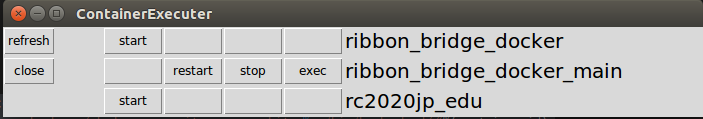

# Docker

Docker環境セットアップの方法とDockerfileをまとめたリポジトリです．

## Install Docker

```bash
# インストールのフォルダへ移動する．
$ cd docker/setup_sh

# 必要なリソースをインストールする．
$ bash install_docker.sh

# Dockerコンテナ内でGPUを使う場合．以下のコマンドも実行する．
$ bash install_nvidia_docker.sh

# コンテナを可視化するため，以下のコマンドも実行してください．
$ sudo apt-get update
$ sudo apt-get install -y python3-tk tk-dev 

# GUIを表示されたら，インストール完了．
$ python3 -m tkinter
```

> **Warning**
> `GPU版`のDockerをインストールする前に，必ず[CUDAとCuDNNのセットアップ](https://github.com/TeamSOBITS/sobits_manual/tree/main/install_sh#cuda)を済ませてください．


## How to use

コンテナの環境情報や起動方法等については，それぞれのコンテナのフォルダの中にあるREADMEを参照してください．


## Container Executer



ビルドされたコンテナの一覧を表示し，それらを起動・再起動・停止・ターミナルの操作ができます．

コマンドを`alias`として設定しておくと，`Container Executer`を速やかに実行できます．

```bash
# 1回のみで実行する
$ echo 'alias ce="python3 ~/docker/container_executer.py"' >> ~/.bashrc
$ source ~/.bashrc
```

設定した`alias`を実行するために，以下のコマンドを入力します．

```bash
$ ce
```

> **Note**
> このコマンドは自分がいるPATHに依存していないため，どこでも実行可能です．